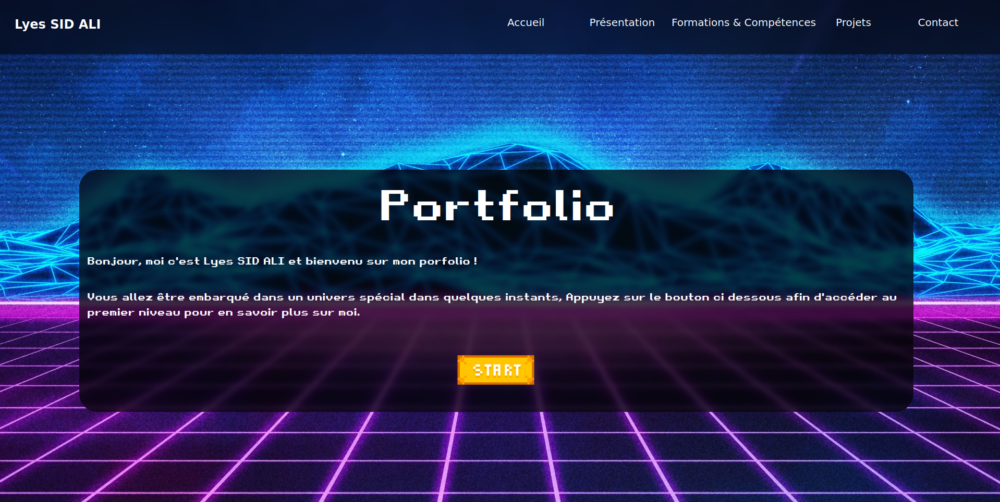

# Portfolio        By   Lyes SID ALI

Ce portfolio est ma première expérience dans le web developpement, je découvre encore de nouvelles fonctionnalitées des langages utilisées et de nouvelles idées à ajouter pour améliorer mon site web.

Voici les fichiers html, css, javascript de mon portfolio que vous pouvez voir en clickant sur le lien suivant : [Cliquez ici pour visiter mon portfolio](http://slylyes.github.io)

Ce portfolio est une page web responsive réalisée avec Visual Studio Code, en utilisant html pour la mise en page, css pour la stylisation, javascript pour les effets de dynamisme de la page, bootstrap pour adapter la page a tout les formats d'écrans.

Voici un aperçu de la page d'acceuil : 

Vous pouvez retrouver dans mon portfolio une présentation de mon parcours et mes différentes compétences, ainsi que les projets universitaires que j'ai réalisé. Vous pouvez également retrouver ces projets dans mes repository sur GitHub.

## Etat du projet

Le portfolio est terminé, il reste des possibilité d'amélioration que je ferai quand j'aurai le temps.
!!! Dernière mise à jour : Mars 2024 !!!
" 

